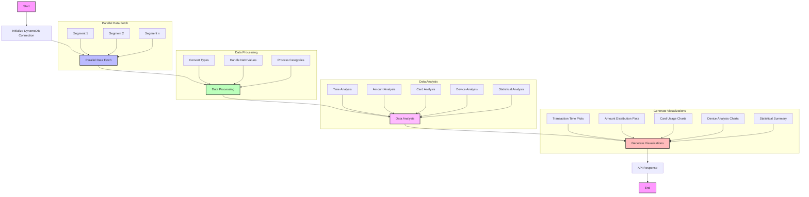

# Fraud Detection Analysis System

A comprehensive system for analyzing fraud detection data using parallel processing and providing visualizations through a REST API.

## Overview

This project provides a scalable solution for analyzing fraud detection data stored in DynamoDB. It uses parallel processing for data fetching and processing, and exposes the analysis through a Flask API endpoint.

## Execution Flowchart

